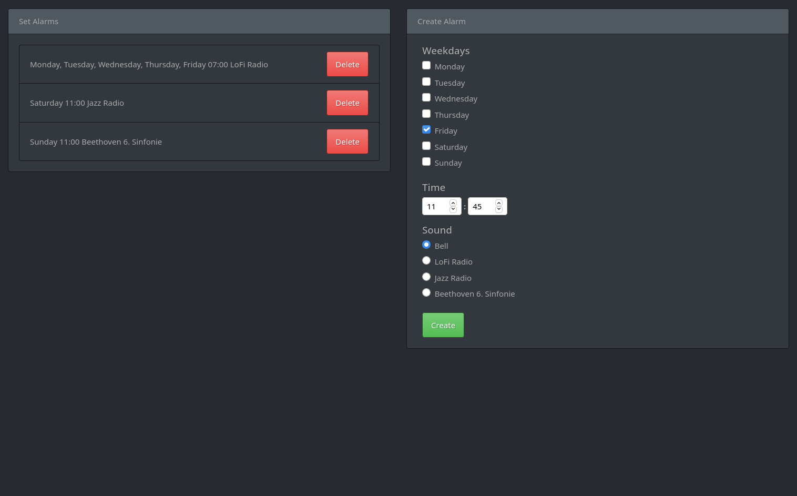

# Wecker
A program that plays a tune at a given point in time in as few SLOC as possible.

### Requirements
- python3
- mpv with support for `ytdl://`

### Installation
```
git clone https://github.com/s-h-3-l-l/Wecker
cd Wecker
pip install -r requirements.txt
```

Manual launch:
```
./launch.sh
```

### Screenshots


### Tested on
- Arch Linux
